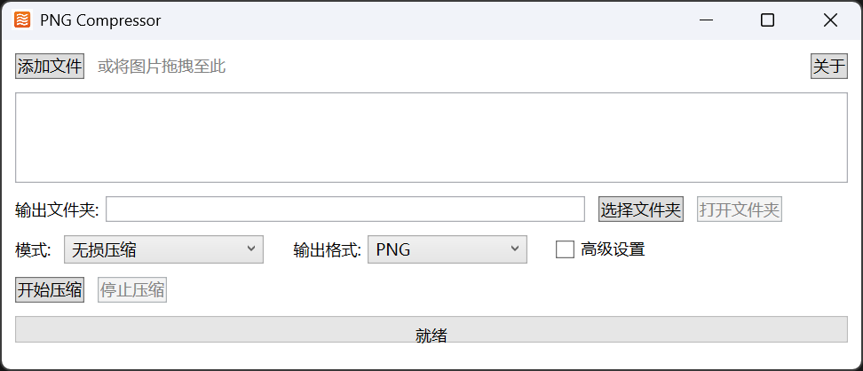

# imgcompressor

imgcompressor 是一个用于在 Windows 上批量压缩和优化图像（主要面向 PNG）的桌面应用程序，基于 WPF 构建，使用 `SixLabors.ImageSharp` 处理图像数据并使用 `Ookii.Dialogs.Wpf` 提供一些系统对话框支持。



## 简介（Overview）
- 项目名称：`imgcompressor`
- 平台：Windows（WPF）
- 目标框架：`.NET 10`（在 `imgcompressor.csproj` 中声明）
- 主要功能：批量压缩图像、保存到指定输出目录、基础 UI 操作（打开、添加、移除、开始压缩）

## 主要特性
- 批量处理图像文件（支持 PNG，其他格式视实现而定）
- 使用 `SixLabors.ImageSharp` 进行图像操作与编码
- 基本的图形界面操作和文件选择对话框（`Ookii.Dialogs.Wpf`）
- 支持拖放或通过对话框选择输入图像（视 UI 实现）

## 先决条件（Prerequisites）
- Windows 10 或更高
- 已安装 .NET 10 SDK（可从 https://dotnet.microsoft.com 下载）
- 推荐使用 Visual Studio 2022/2023 或 Rider（用于打开和调试 WPF 项目）

## 依赖（Dependencies）
项目文件 `imgcompressor.csproj` 中声明的第三方包：
- `Ookii.Dialogs.Wpf` (v5.0.1)
- `SixLabors.ImageSharp` (v3.1.12)

## 构建与运行（Build & Run）
在项目根目录（包含 `imgcompressor.csproj`）下执行：

```bash
# 恢复依赖并构建
dotnet restore
dotnet build

# 运行（使用 dotnet CLI）
dotnet run --project .
```

或者在 Visual Studio 中：
1. 打开解决方案或项目 `imgcompressor.csproj`。
2. 选择调试目标为 `imgcompressor`（启动类型为 WinExe）。
3. 运行/调试。

注：WPF GUI 在非 Windows 平台上不可用。

## 使用说明（Usage）
1. 启动应用程序。
2. 通过“打开”或拖放将图像添加到处理列表。
3. 选择输出目录和压缩/质量设置。
4. 点击“开始”或“压缩”按钮以开始处理。处理完成后，输出目录将包含压缩后的文件。

## 项目结构（Project Structure）
仓库中重要文件：
- `imgcompressor.csproj` — 项目文件与依赖声明
- `App.xaml` / `App.xaml.cs` — 应用入口
- `MainWindow.xaml` / `MainWindow.xaml.cs` — 主界面与交互逻辑
- `PNG.cs` — PNG 相关的处理逻辑（压缩或优化实现）
- `AboutWindow.xaml` / `AboutWindow.xaml.cs` — 关于窗口

## 常见问题（FAQ）
Q: 为什么运行后没有界面/出现异常？
A: 确认运行环境为 Windows，并安装了匹配的 .NET 10 SDK；建议使用 Visual Studio 来捕获异常并调试。

Q: 我想支持更多图像格式或自定义压缩参数，应该从哪里修改？
A: 查看 `PNG.cs`（或其它处理类）以及 `MainWindow.xaml.cs` 中的图像处理流程，扩展或替换 `ImageSharp` 的编码参数以支持更多格式与设置。

## 贡献（Contributing）
欢迎提交 issue 或 pull request：
- 提交前请确保代码能通过构建并尽量包含单元测试（如果添加了测试项目）。
- 使用清晰的 commit 信息并在 PR 描述中说明更改目的。

## 许可证（License）
GNU General Public License v3.0

## 联系（Contact）
有关问题或建议，请在仓库中打开 issue。